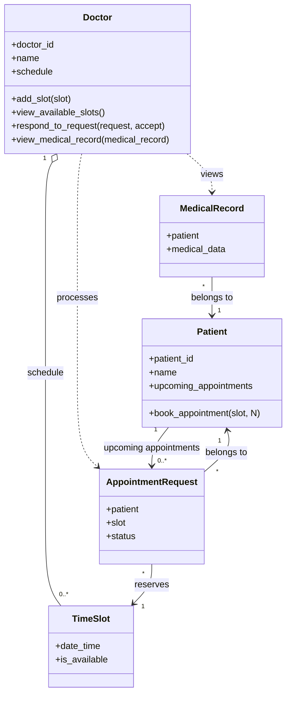

# 4. Class Diagram

```mermaid
classDiagram
    class Patient {
        +patient_id
        +name
        +upcoming_appointments
        +book_appointment(slot, N)
    }

    class Doctor {
        +doctor_id
        +name
        +schedule
        +add_slot(slot)
        +view_available_slots()
        +respond_to_request(request, accept)
        +view_medical_record(medical_record)
    }

    class TimeSlot {
        +date_time
        +is_available
    }

    class AppointmentRequest {
        +patient
        +slot
        +status
    }

    class MedicalRecord {
        +patient
        +medical_data
    }

    Patient "1" --> "0..*" AppointmentRequest : upcoming appointments
    AppointmentRequest "*" --> "1" Patient : belongs to
    AppointmentRequest "*" --> "1" TimeSlot : reserves
    Doctor "1" o-- "0..*" TimeSlot : schedule
    MedicalRecord "*" --> "1" Patient : belongs to
    Doctor ..> AppointmentRequest : processes
    Doctor ..> MedicalRecord : views
```