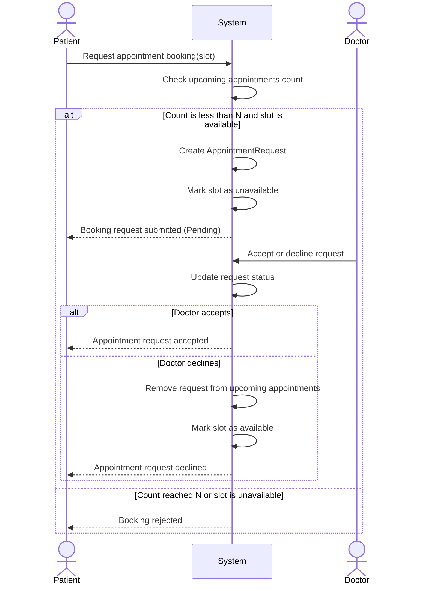

# 5. Sequence Diagram

```mermaid
sequenceDiagram
    actor Patient
    participant System
    actor Doctor

    Patient->>System: Request appointment booking(slot)
    System->>System: Check upcoming appointments count

    alt Count is less than N and slot is available
        System->>System: Create AppointmentRequest
        System->>System: Mark slot as unavailable
        System-->>Patient: Booking request submitted (Pending)
        Doctor->>System: Accept or decline request
        System->>System: Update request status

        alt Doctor accepts
            System-->>Patient: Appointment request accepted
        else Doctor declines
            System->>System: Remove request from upcoming appointments
            System->>System: Mark slot as available
            System-->>Patient: Appointment request declined
        end

    else Count reached N or slot is unavailable
        System-->>Patient: Booking rejected
    end
```
