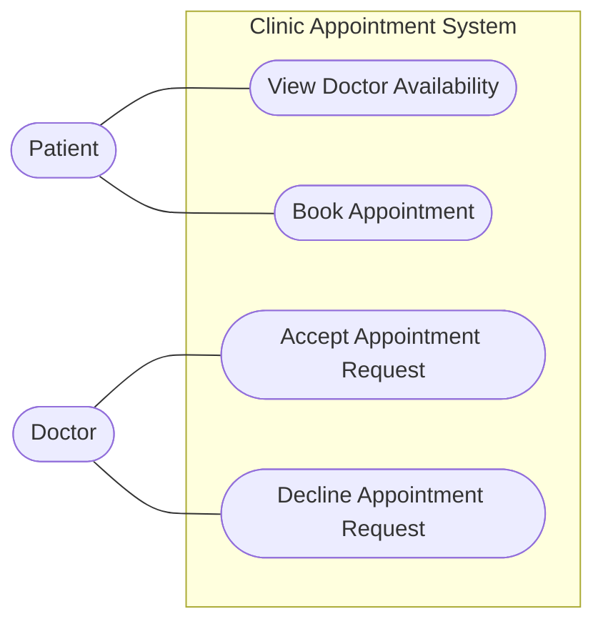

## Use Case Diagram

```mermaid
flowchart LR
    Patient([Patient])
    Doctor([Doctor])

    subgraph Clinic Appointment System
        UC1([View Doctor Availability])
        UC2([Book Appointment])
        UC3([Accept Appointment Request])
        UC4([Decline Appointment Request])
    end

    Patient --- UC1
    Patient --- UC2
    Doctor --- UC3
    Doctor --- UC4
```
